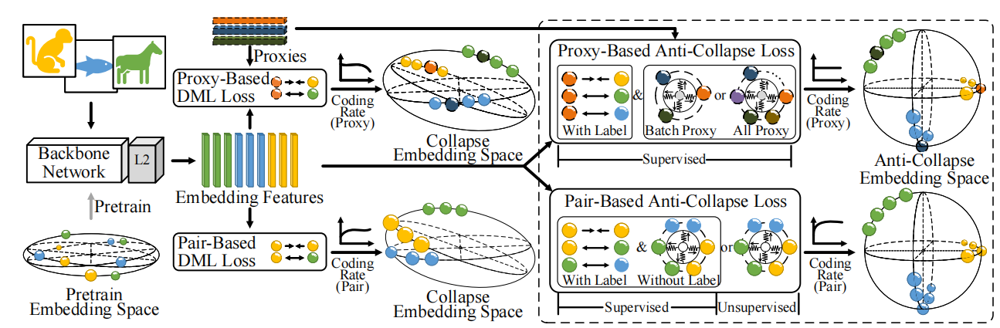

## Anti-Collapse Loss for Deep Metric Learning Based on Coding Rate Metric
This repository contains the official PyTorch implementation of the paper:**Anti-Collapse Loss for Deep Metric Learning Based on Coding Rate Metric**


Introduction
---
Our work introduces a novel solution called "Anti-Collapse Loss" to address the issue of embedding space collapse in deep metric learning. This method aims to preserve the structure of the embedding space, prevent feature collapse, and draws inspiration from coding rate principles. We integrate this loss with existing methods, leading to significant improvements in image retrieval performance on benchmark datasets. Comprehensive experiments and detailed analyses validate the effectiveness of this approach in preventing collapse and enhancing generalization performance.
This repository contains datasets and source code to show the performance of our paper **Anti-Collapse (AntiCo) Loss for Deep Metric Learning Based on Coding Rate Metric**


Algorithm Flow
---
- **AntiCo** algorithm flowchart illustrates:

    - (1)  The embedding space collapse caused by label dependency in existing methods.
    - (2) How Pair-based Anti-Collapse Loss, Batch-based Proxy Anti-Collapse Loss, and All Proxy-based Anti-Collapse Loss address the issue of embedding space collapse.



Requirements
---
   - For the ease of reproducibility, you are suggested to install [anaconda](https://www.anaconda.com/distribution/) before following executing the following commands. 
   
```bash
conda create -y -n antico python=3.7 (version>=3.5)
source activate antico
conda activate myenv
pip install -r requirements.txt
```
   - The batch-size=90 assumes your have a graphics card with 24GB video memory,e,g NVIDIA GeForce RTX 3090, for Antico training.You may reduce the batch size if you have less video memory.
   - Our code utilizes `PyTorch 2.0` to further enhance training speed. Of course it is still compatible with previous `PyTorch` versions. When installing `PyTorch`, make sure to select a version that matches your system's `CUDA` version. 

How to use
---
The code is currently tested only on GPU.
- Data Preparation

    **DataSets**
    - [Car-196](http://ai.stanford.edu/~jkrause/cars/car_devkit.tgz)
    - [CUB-200-2011](http://www.vision.caltech.edu/visipedia-data/CUB-200/images.tgz)
    - [Stanford-Online-Products](ftp://cs.stanford.edu/cs/cvgl/Stanford_Online_Products.zip)

- Source Code Details
    
    You can directly run `antico_runs.sh` to initiate the training. This script includes pre-configured instructions for various networks or datasets. Of course, you are also free to modify these parameters. Further parameters and their default values are located in 'parameters.py', which you can adjust according to your requirements.


